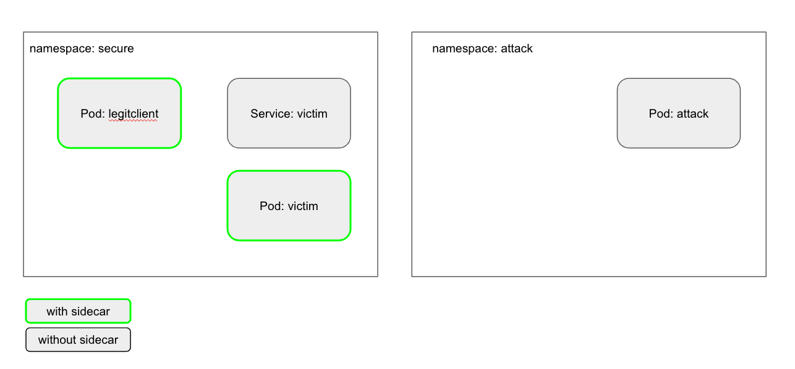

# Generating Istio mTLS Client Certs Using Stolen Credentials

Istio service mesh encrypts traffic and validates workload identity using mTLS. In order to populate the sidecar proxies with keys for this use case, the istiod controller contains a certificate authority called citadel, which the sidecar proxies call home to on startup to request client certs. Like many Kubernetes native technologies, access to citadel requires the caller to present a valid Kubernetes service account token. No token, no mTLS client cert.

It is well understood in many contexts that security account tokens should be protected, but (in my experience) it does not seem to be well understood that access to a security account token == ability to spoof identity in the service mesh.

This repo demonstrates the situation.

### Test Setup

The setup contains two namespaces. In the secure namespace is a deployment and service called "victim", and a deployment called "legitclient". An Istio `PeerAuthentication` resource requires all traffic in this namespace to be mTLS encrypted (cleartext traffic will be rejected) and an Istio `AuthorizationPolicy` requires all traffic destined for the "victim" workloads to be identified by the SPIFFE identity `spiffee://cluster.local/ns/secure/sa/legitclient`, which can be read as "this request is coming from the 'secure' namespace and the requesting pod is using the 'legitclient' Kubernetes service account". See [secure.yaml](secure.yaml) for specifics.

### Running The Test

#### Requirements
- a running cluster / valid kubeconfig
- `istioctl install -y` (tested on 1.14 - 1.16)
- openssl
- jq
- [grpcurl](https://github.com/fullstorydev/grpcurl)

When the script executed the following steps will take place:
1. a new private key and certificate signing request will be generated
1. the service account token from the sidecar container of the legitclient pod will be "stolen"
1. the stolen service account token will be used to send the csr to istiod/citadel asking for a signed mTLS client certificate
1. citadel will accept the stolen token and sign the csr, returning an mTLS client certificate with the identity data populated by the claims present in the stolen token
1. we will attempt to plaintext curl the victim service from within the attack pod in the attack namespace, since mTLS is required this connection will be rejected (reset by peer)
1. we will attempt to curl the victim service from within the attack pod in the attack namespace, but this time using the private key and signed client certificate, which will be authenticated using the identity of the legitclient in the secure namespace.
